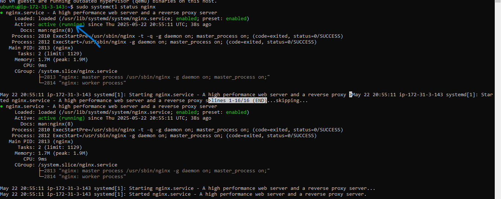
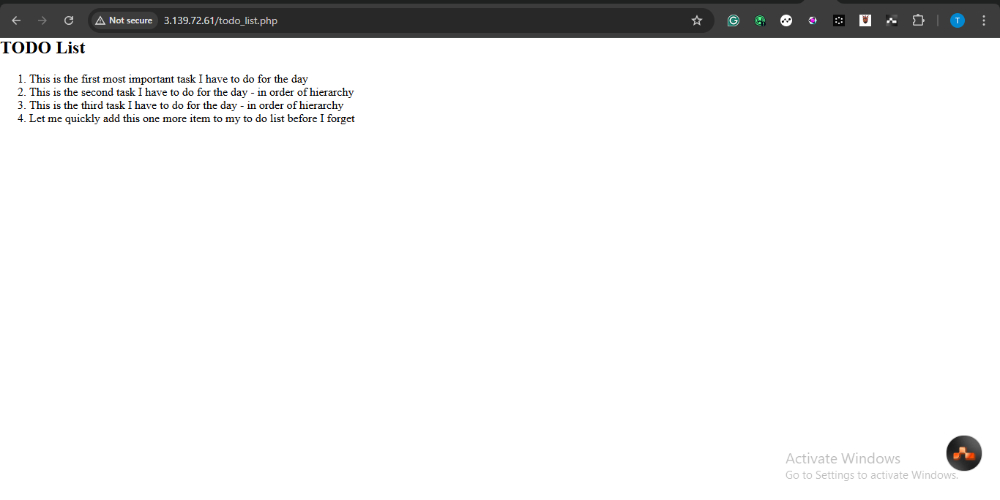

## WEB (LEMP) STACK IMPLEMENTATION IN AWS

### Introduction
The LEMP Stack is a popular web development platform made up of four components: **Linux, Nginx (pronounced "Engine-X"), MySQL,** and **PHP** (or Perl/Python). This guide will walk you through the configuration and usage of the LEMP Stack on AWS.

## Step 0: Prerequisites

1. **Launch an EC2 Instance**: Start by launching a t2.micro EC2 instance (or any compute engine) running Ubuntu 24.04 LTS or later. Choose a region close to your target audience. (This guide assumes you’re using AWS, but you can adapt these steps for other cloud providers.)

   

2. **Create an SSH Key Pair**: Name it `Mywebtest` (or any name you prefer) to access your instance via SSH on port 22.

3. **Configure Security Group**: Set up your instance’s security group with these inbound rules:
   - Allow HTTP traffic (port 80) from anywhere.
   - Allow HTTPS traffic (port 443) from anywhere.
   - Allow SSH traffic (port 22) from anywhere (this is usually enabled by default).

   

4. **Use Default VPC and Subnet**: Keep the default VPC and subnet configurations.

   

5. **Download the Private SSH Key**: If you're using Linux or macOS, change the permissions before use:
   ```bash
   chmod 400 Mywebtest.pem
   ```
   Then connect to the instance with:
   ```bash
   ssh -i "Mywebtest.pem" ubuntu@<instance-ip>
   ```
   (Replace `<instance-ip>` with your instance's public IP, e.g., `3.139.72.61`.)

   

## Step 1: Install Nginx

1. **Update and Upgrade Packages**:
   ```bash
   sudo apt update
   sudo apt upgrade -y
   ```
   

2. **Install Nginx**:
   ```bash
   sudo apt install nginx -y
   ```
   

3. **Check Nginx Status**:
   ```bash
   sudo systemctl status nginx
   ```
   Look for the green "active (running)" status.

   

4. **Test Nginx**:
   ```bash
   curl http://localhost:80
   ```

5. **Access Nginx in Your Browser**: Open your browser and navigate to:
   ```
   http://3.139.72.61
   ```
   

6. **Get Your Public IP**: You can also retrieve your instance's public IP with:
   ```bash
   curl -s http://169.254.169.254/latest/meta-data/public-ipv4
   ```

## Step 2: Install MySQL

1. **Install MySQL**:
   ```bash
   sudo apt install mysql-server
   ```
   

2. **Log into MySQL**:
   ```bash
   sudo mysql
   ```
   

3. **Set Root Password**:
   ```sql
   ALTER USER 'root'@'localhost' IDENTIFIED WITH mysql_native_password BY 'RootPass.3';
   ```

   

   Log out:
   ```sql
   EXIT;
   ```

4. **Secure MySQL**:
   ```bash
   sudo mysql_secure_installation
   ```

   

5. **Test MySQL Login**:
   ```bash
   sudo mysql -p
   ```
   Exit when done:
   ```sql
   EXIT;
   ```

## Step 3: Install PHP

1. **Install PHP**:
   ```bash
   sudo apt install php-fpm php-mysql -y
   ```
   

## Step 4: Configure Nginx for PHP

1. **Create a Web Directory**:
   ```bash
   sudo mkdir /var/www/projectLEMP
   ```

2. **Change Ownership**:
   ```bash
   sudo chown -R $USER:$USER /var/www/projectLEMP
   ```
   

3. **Create Nginx Config File**:
   ```bash
   sudo vim /etc/nginx/sites-available/projectLEMP
   ```
   Paste the following configuration:
   ```nginx
   server {
       listen 80;
       server_name projectLEMP www.projectLEMP;
       root /var/www/projectLEMP;

       index index.html index.php;

       location / {
           try_files $uri $uri/ =404;
       }

       location ~ \.php$ {
           include snippets/fastcgi-php.conf;
           fastcgi_pass unix:/var/run/php/php8.1-fpm.sock;
       }
   }
   ```

   

4. **Activate the Configuration**:
   ```
   sudo ln -s /etc/nginx/sites-available/projectLEMP /etc/nginx/sites-enabled/
   ```

   

5. **Test Nginx Configuration**:
   ```bash
   sudo nginx -t
   ```
   

6. **Disable Default Config**:
   ```bash
   sudo unlink /etc/nginx/sites-enabled/default
   ```

7. **Create an Index Page**:
   ```bash
   sudo echo 'Hello Nginx > /var/www/projectLEMP/index.html
   ```

   Now, access your site via your public IP in a browser to see the result!

   

## Step 5: Test PHP Requests

1. **Create a Sample PHP File**:
   ```bash
   sudo nano /var/www/projectLEMP/info.php
   ```
   Add the following code:
   ```php
   <?php phpinfo(); ?>
   ```

2. **Access via Browser**:
   ```
   http://3.139.72.61/info.php
   ```


   After verifying, remove the file:
   ```bash
   sudo rm /var/www/projectLEMP/info.php
   ```

## Step 6: Create and Retrieve Data from MySQL

1. **Log into MySQL**:
   ```bash
   sudo mysql -p
   ```

2. **Create a Database**:
   ```sql
   CREATE DATABASE todo_database;
   ```

3. **Create a User and Grant Privileges**:
   ```sql
   CREATE USER 'user1'@'%' IDENTIFIED WITH mysql_native_password BY 'RootPass.3';
   GRANT ALL ON todo_database.* TO 'user1'@'%';
   ```

4. **Login as New User**:
   ```bash
   mysql -u user1 -p
   ```

5. **Create a Table**:
   ```sql
   USE todo_database;
   CREATE TABLE todo_list (
       item_id INT AUTO_INCREMENT,
       content VARCHAR(255),
       PRIMARY KEY (item_id)
   );
   ```

6. **Insert Records**:
   ```sql
   INSERT INTO todo_database.todo_list (content) VALUES ("This is the first most important task I have to do for the day");

   INSERT INTO todo_database.todo_list (content) VALUES ("This is the second task I have to do for the day - in order of hierarchy");

   INSERT INTO todo_database.todo_list (content) VALUES ("This is the third task I have to do for the day - in order of hierarchy");

   INSERT INTO todo_database.todo_list (content) VALUES ("Let me quickly add this one more item to my to do list before I forget");
   ```

7. **Verify Data**:
   ```sql
   SELECT * FROM todo_list;
   ```


   Exit MySQL:
   ```sql
   EXIT;
   ```

8. **Create a PHP Script to Retrieve Data**:
   ```bash
   sudo nano /var/www/projectLEMP/todo_list.php
   ```

   Add this code:
   ```php
   <?php
   $user = "user1";
   $password = "RootPass.3";
   $database = "todo_database";
   $table= "todo_list";

   try {
       $db = new PDO("mysql:host=localhost;dbname=$database", $user, $password);
       echo "<h2>TODO List</h2><ol>";
       foreach ($db->query("SELECT content FROM $table") as $row) {
           echo "<li>" . $row['content'] . "</li>";
       }
       echo "</ol>";
   } catch (PDOException $e) {
       echo "Connection failed: " . $e->getMessage();
   }
   ?>
   ```

9. **Access Your To-Do List**:
   ```
   http://3.139.72.61/todo_list.php
   ```


## Conclusion
Congratulations! You've successfully set up a LEMP stack on AWS. This LEMP stack (just like the LAMP stack) provides a solid platform for hosting and serving web apps. If you as a developer want to deploy scalable solutions that can be relied upon, then you would need to seriously consider one of these stacks as they have been tested, tried and proven to meet expectations.

